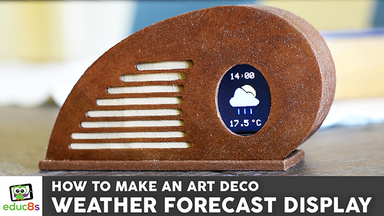

# ESP8266-Weather-Display-with-Art-Deco-enclosure

This project uses a Wemos D1 mini board along with a 1.8” Color TFT screen to display the weather forecast. I also designed and 3d printed an enclosure for this project using wood filament! I got the inspiration for this Art Deco style enclosure from an old radio. I wanted a design for the Weather Station that would be unique and somehow artistic, I was bored of the square enclosures without any character. <b>I wanted something to make me feel good when looking at it.</b>

The project connects to the internet and retrieves the weather forecast for my location and displays it on the screen. The project only displays the weather icon, the temperature and the time of the prediction because I wanted a minimal look for this project. Of course you can easily add more information if you wish.

  

# Full Instructions Video

Watch the video here: https://www.youtube.com/watch?v=CAlKUCjfKFM

# Parts Needed

The parts needed in order to build this project are the following:

🛒 Wemos D1 mini board ▶ http://educ8s.tv/part/D1Mini

🛒 1.8” Color TFT display ▶ http://educ8s.tv/part/7735

🛒 Some wires ▶ http://educ8s.tv/part/Wires

🛒 Wood Filament ▶ http://educ8s.tv/part/WoodFilament

<b>The cost of the project is very low it is around $12!</b>

# 3D Printed Enclosure

We also need an enclosure for this project. If you like the Art Deco enclosure I designed for this project you download it from Thingiverse.

🔗 Enclosure Files ▶ http://www.thingiverse.com/thing:1964380

💖 Full disclosure: All of the links above are affiliate links. I get a small percentage of each sale they generate. Thank you for your support!
